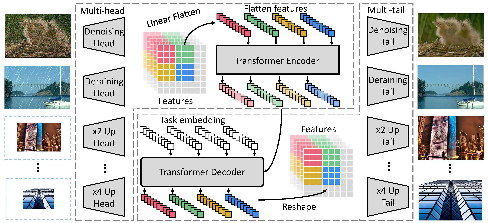

# Contents

- [IPT Description](#ipt-description)
- [Model-architecture](#model-architecture)
- [Dataset](#dataset)
- [Environmental requirements](#environmental-requirements)
- [Performance](#performance)
    - [Training performance](#training-performance)
    - [Evaluation performance](#evaluation-performance)

# [IPT Description](#contents)

This repository is an official implementation of the paper "Pre-Trained Image Processing Transformer" from CVPR 2021.

We study the low-level computer vision task (e.g., denoising, super-resolution and deraining) and develop a new
pre-trained model, namely, image processing transformer (IPT). To maximally excavate the capability of transformer, we
present to utilize the well-known ImageNet benchmark for generating a large amount of corrupted image pairs. The IPT
model is trained on these images with multi-heads and multi-tails. In addition, the contrastive learning is introduced
for well adapting to different image processing tasks. The pre-trained model can therefore efficiently employed on
desired task after fine-tuning. With only one pre-trained model, IPT outperforms the current state-of-the-art methods on
various low-level benchmarks.

If you find our work useful in your research or publication, please cite our work:
[1] Hanting Chen, Yunhe Wang, Tianyu Guo, Chang Xu, Yiping Deng, Zhenhua Liu, Siwei Ma, Chunjing Xu, Chao Xu, and Wen
Gao. **"Pre-trained image processing transformer"**. <i>**CVPR 2021**.</i> [[arXiv](https://arxiv.org/abs/2012.00364)]

    @inproceedings{chen2020pre,
      title={Pre-trained image processing transformer},
      author={Chen, Hanting and Wang, Yunhe and Guo, Tianyu and Xu, Chang and Deng, Yiping and Liu, Zhenhua and Ma, Siwei and Xu, Chunjing and Xu, Chao and Gao, Wen},
      booktitle={CVPR},
      year={2021}
     }

# [Model architecture](#contents)

### The overall network architecture of IPT is shown as below

# [Dataset](#contents)

The benchmark datasets can be downloaded as follows:

For super-resolution:

Set5,
[Set14](https://sites.google.com/site/romanzeyde/research-interests),
[B100](https://www2.eecs.berkeley.edu/Research/Projects/CS/vision/bsds/),
Urban100.

For denoising:

[CBSD68](https://www2.eecs.berkeley.edu/Research/Projects/CS/vision/bsds/).

For deraining:

[Rain100L](https://www.icst.pku.edu.cn/struct/Projects/joint_rain_removal.html)

The result images are converted into YCbCr color space. The PSNR is evaluated on the Y channel only.

# [Environmental requirements](#contents)

## Hardware (Ascend)

> Prepare hardware environment with Ascend.

## Framework

> [MindSpore>=1.9](https://www.mindspore.cn/install/en)

## For more information, please check the resources below

[MindSpore Tutorials](https://www.mindspore.cn/tutorials/en/master/index.html)
[MindSpore Python API](https://www.mindspore.cn/docs/en/master/index.html)

# [Performance](#contents)

## [Training Performance](#contents)

### Training speed.

At mindspore, dynamic shape will take additional costs. Especially on two image with a large difference in size.

| Platform      | Device type | Device      | training time for each step(seconds) |
|---------------|-------------|-------------|--------------------------------------|
| IPT-MS-Ascend | Ascend      | Ascend-910A | 0.159 (batch size: 32)               |

## [Evaluation Performance](#contents)

The Results on all tasks are listed as below.

Super-resolution results:

| Scale | Set5  | Set14 | B100  | Urban100 |
|-------|-------|-------|-------|----------|
| ×2    | 38.33 | 34.49 | 32.46 | 33.74    |
| ×3    | 34.86 | 30.85 | 29.38 | 29.50    |
| ×4    | 32.71 | 29.03 | 27.84 | 27.24    |

Denoising results:

| noisy level | CBSD68 | Urban100 |
|-------------|--------|----------|
| 30          | 32.35  | 33.99    |
| 50          | 29.93  | 31.49    |

Derain results:

| Task   | Rain100L |
|--------|----------|
| Derain | 42.08    |

Inference Speed on Super-resolution (x4) task:

| Platform                                                     | Device type | Device      | Inference time for images in set5 dataset (seconds) |
|--------------------------------------------------------------|-------------|-------------|-----------------------------------------------------|
| IPT-Torch                                                    | GPU         | V100        | 1.33, 0.69, 0.59, 0.69, 1.09                        |
| IPT-MS (mindspore 1.7)                                       | GPU         | V100        | 39.29, 13.45, 0.69, 0.71, 14.01                     |
| IPT-MS-Ascend (mindspore 1.9, Graph Mode)                    | Ascend      | Ascend-910A | 419.53, 254.83, 9.49, 22.68, 275.21                 |
| IPT-MS-Ascend (mindspore 1.9, Pynative Mode)                 | Ascend      | Ascend-910A | 635.53, 195.69, 14.94, 15.07, 271.17                |
| IPT-MS-Ascend (mindspore 1.9, Graph Mode, warmup 50 exps)    | Ascend      | Ascend-910A | 2.74, 2.68, 2.47, 2.38, 2.56                        |
| IPT-MS-Ascend (mindspore 1.9, Pynative Mode, warmup 50 exps) | Ascend      | Ascend-910A | 4.43, 4.10, 4.44, 4.03, 4.11                        |
