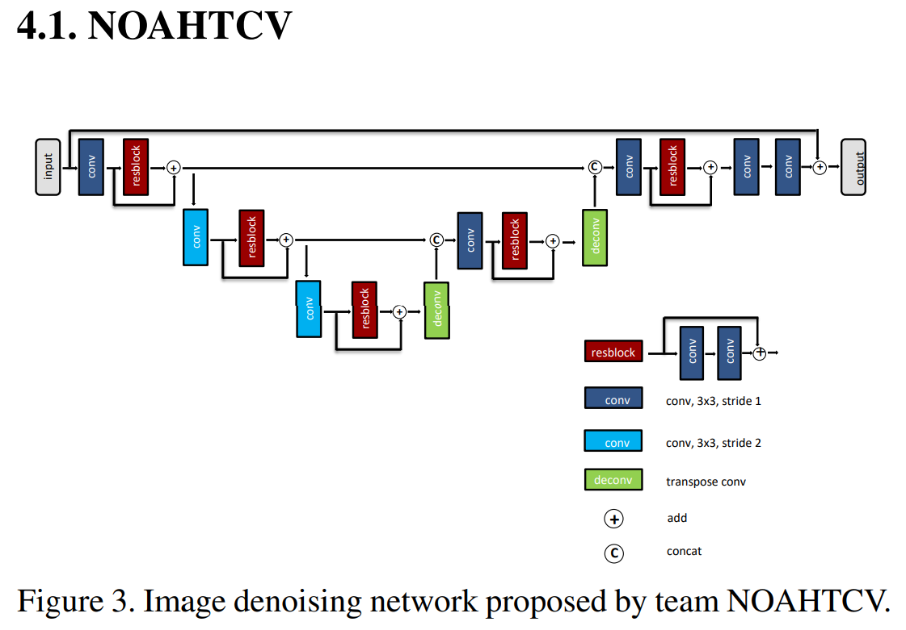

# Contents

- [NoahTCV Description](#noahtcv-description)
- [Model-architecture](#model-architecture)
- [Dataset](#dataset)
- [Environmental requirements](#environmental-requirements)
- [Performance](#performance)
    - [Training performance](#training-performance)
    - [Evaluation performance](#evaluation-performance)

# [NoahTCV Description](#contents)

Team NOAHTCV became a winner in Mobile AI challenge 2021. They applied Neural Architecture Search to find an
optimal model for image denoising task.
Here you can find the final architecture.

[Paper](https://arxiv.org/pdf/2105.08629.pdf): Fast Camera Image Denoising on Mobile GPUs with Deep Learning, Mobile AI 2021 Challenge: Report.

# [Model architecture](#contents)



# [Dataset](#contents)

The challenge training dataset can be downloaded from
the [cite](https://competitions.codalab.org/competitions/28120#participate-get-data). There are 658 images 3000x4000
px.

The offline preprocessing should be done to prepare the dataset: crop 256x256 images with step=192 from each training
image and then shuffle. So there are 197400 RGB images in total:
```
|--train
| |--sharp
| | |--000000.jpeg
| | |--000001.jpeg
| | |--...
| | |--197399.jpeg
| |--noisy
| | |--000000.jpeg
| | |--...
| | |--197399.jpeg
```

For improving quality, synthetic random noise was added to ground truth images.

The evaluation can be done on [CBSD68](https://www2.eecs.berkeley.edu/Research/Projects/CS/vision/bsds/) dataset.
```
|--test
| |--noisy5
| | |--0000.png
| | |--0001.png
| | |--...
| | |--0067.png
| |--noisy10
| | |--0000.png
| | |--0001.png
| | |--...
| | |--0067.png
| |--noisy15
| | |--0000.png
| | |--0001.png
| | |--...
| | |--0067.png
| |--noisy25
| | |--0000.png
| | |--0001.png
| | |--...
| | |--0067.png
| |--noisy35
| | |--0000.png
| | |--0001.png
| | |--...
| | |--0067.png
| |--noisy50
| | |--0000.png
| | |--0001.png
| | |--...
| | |--0067.png
| |--original_png
| | |--0000.png
| | |--0001.png
| | |--...
| | |--0067.png
```

# [Environmental requirements](#contents)

## GPU

- Hardware (GPU)
    - Prepare hardware environment with GPU processor
- Framework
    - [MindSpore](https://www.mindspore.cn/install)
- For details, see the following resources:
    - [MindSpore Tutorial](https://www.mindspore.cn/tutorials/zh-CN/master/index.html)
    - [MindSpore Python API](https://www.mindspore.cn/docs/zh-CN/master/index.html)
- Additional python packages:
    - Install additional packages manually or using `pip install -r requirements.txt` command in the model directory.

## Ascend 910

- Hardware (Ascend)
    - Prepare hardware environment with Ascend 910 (cann_5.1.2, euler_2.8.3, py_3.7)
- Framework
    - [MindSpore 2.0.0-alpha](https://www.mindspore.cn/install) or later

# [Performance](#contents)

## Training parameters

For training on Ascend is_use_dynamic_loss_scale should be set to True.

| Parameters                 | Value                                                                    |
|----------------------------|--------------------------------------------------------------------------|
| Model                      | NoahTCV                                                                  |
| Resources                  | 1x Tesla V100-SXM2-32GB, Ascend-910A                                     |
| MindSpore Version          | 1.9.0                                                                    |
| Dataset                    | MAI21Denoising, 300 crops per image with step=192, total - 197400 images |
| Augmentations              | Synthetic random noise                                                   |
| Input patch size           | 256x256                                                                  |
| Training Parameters        | batch_size=64, lr=0.0001 and cosine after 50 epochs, use_bn = False      |
| Optimizer                  | Adam                                                                     |
| Number of epochs           | 200                                                                      |

## Quality/Performance

| Parameters                 | Value                                                                    |
|----------------------------|--------------------------------------------------------------------------|
| Model                      | NoahTCV                                                                  |
| Resources                  | 1x Tesla V100, Ascend-910A                                               |
| MindSpore Version          | 1.9.0                                                                    |
| Dataset                    | CBSD68, noise level = 50                                                 |
| Input patch size           | 480x320 (input 481x321 is resized down to 1 px to suit UNET architecture)|
| Batch size                 | 1                                                                        |

PSNR on model trained using challenge's dataset with real noise:

| Model               | Device type | Device      | PSNR on eval (dB) |
|---------------------|-------------|-------------|-------------------|
| Noahtcv-MS          | GPU         | v100        | 18.07 (epoch 200) |
| Noahtcv-MS          | Ascend      | Ascend-910A | 17.65 (epoch 60)  |

Since the model trained on the original dataset shows unsatisfactory results on CBSD68,
the final checkpoint was trained using synthetic noise upon the challenge's groud truth data
and the accuracy has improved significantly.

## [Training Performance](#contents)

| Model               | Device type | Device      | PSNR on eval (dB) | Train time per epoch, s|
|---------------------|-------------|-------------|-------------------|------------------------|
| Noahtcv-MS          | 1 x GPU     | v100        | 26.718            | 775                    |
| Noahtcv-MS          | 1 x Ascend  | Ascend-910A | 26.797            | 989                    |

## [Evaluation Performance](#contents)

| Model      | Device type | Device      | Time per step, s (batch size=1) |
|------------|-------------|-------------|---------------------------------|
| Noahtcv-MS | GPU         | v100        | 0.004                           |
| Noahtcv-MS | Ascend      | Ascend-910A | 0.005                           |
